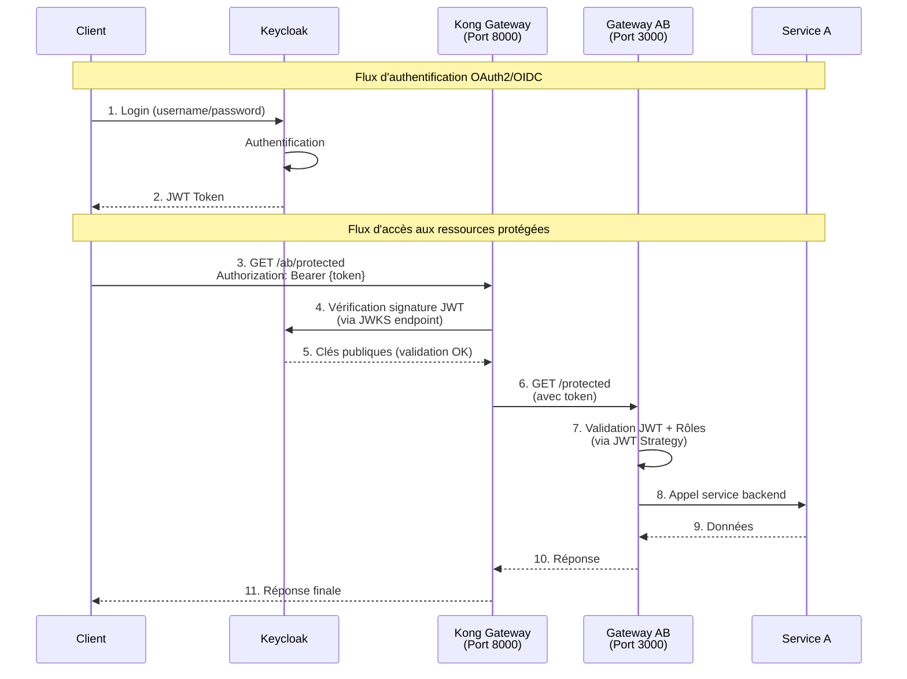
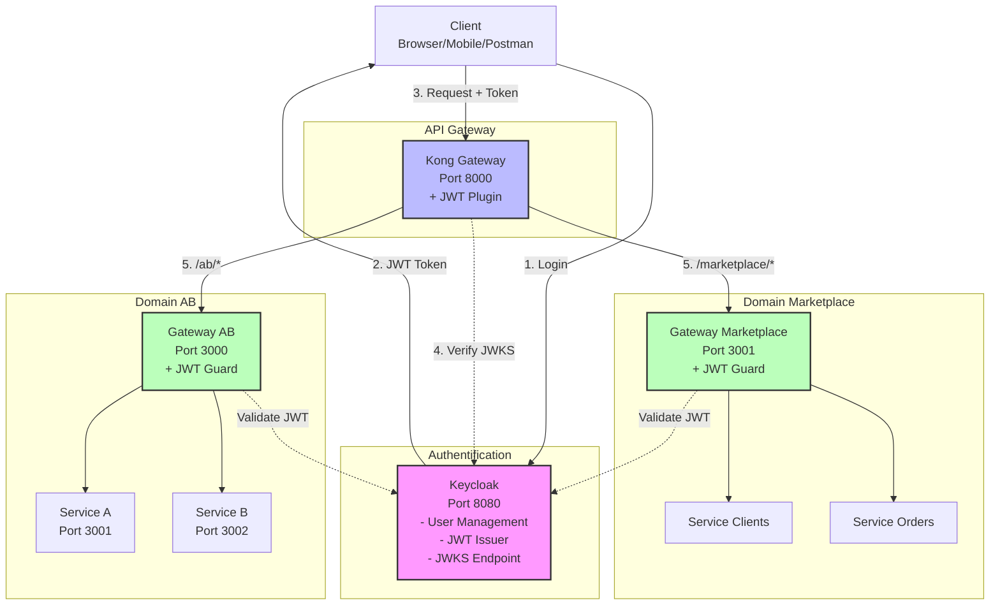

# Tutoriel : Authentification et Autorisation avec Keycloak

## 🎯 Objectifs d'Apprentissage

Dans ce tutoriel, vous allez apprendre à :
- Comprendre le rôle de l'**authentification et autorisation** dans une architecture microservices
- Découvrir les protocoles **OAuth2** et **OpenID Connect**
- Installer et configurer **Keycloak** comme serveur d'identité centralisé
- Implémenter la sécurité par **tokens JWT**
- Protéger vos API avec des **guards** et des **rôles**
- Intégrer Keycloak avec Kong et NestJS

## 📚 Contexte

Actuellement, votre architecture présente des failles de sécurité :
- **Aucune authentification** : N'importe qui peut accéder aux API
- **Aucune autorisation** : Impossible de gérer les permissions par rôle
- **Gestion utilisateurs dispersée** : Chaque service gère ses propres utilisateurs
- **Pas de Single Sign-On (SSO)** : Les utilisateurs doivent se connecter à chaque service

**Problème** : Sans authentification centralisée, impossible de sécuriser l'accès aux ressources et de gérer les utilisateurs de manière cohérente.

**Solution** : **Keycloak** est un serveur d'identité open-source qui centralise l'authentification et l'autorisation en utilisant les standards OAuth2 et OpenID Connect.

## 🏗️ Architecture Cible



**Architecture globale** :



**Avantages** :
- ✅ Authentification centralisée (Single Sign-On)
- ✅ Gestion des utilisateurs et rôles unifiée
- ✅ Sécurité par tokens JWT (stateless)
- ✅ Support OAuth2/OpenID Connect (standards)
- ✅ Intégration facile avec Kong et NestJS

---

## 📋 Prérequis

- Docker et Docker Compose installés
- Avoir suivi TODO-KONG.md et TODO-CONSUL.md
- Connaissances de base en authentification (sessions, tokens)
- Postman ou curl pour tester les APIs

---

## 🛠️ Étape 1 : Installation de Keycloak

### 1.1 Comprendre Keycloak

**Keycloak** est un serveur d'identité et de gestion des accès open-source développé par Red Hat. Il fournit :
- **Authentification** : Vérification de l'identité des utilisateurs
- **Autorisation** : Gestion des permissions et rôles
- **Single Sign-On (SSO)** : Une seule connexion pour tous les services
- **Identity Brokering** : Délégation à des fournisseurs externes (Google, Facebook, etc.)
- **User Federation** : Synchronisation avec LDAP, Active Directory, etc.

### 1.2 Ajouter Keycloak au `compose.yaml`

**`compose.yaml`** - Ajouter le service Keycloak :

```yaml
services:
  # ... services existants (rabbitmq, kong, consul)

  keycloak:
    image: quay.io/keycloak/keycloak:latest
    container_name: keycloak
    environment:
      KC_BOOTSTRAP_ADMIN_USERNAME: admin
      KC_BOOTSTRAP_ADMIN_PASSWORD: admin
      KC_DB: postgres
      KC_DB_URL: jdbc:postgresql://postgres:5432/keycloak
      KC_DB_USERNAME: keycloak
      KC_DB_PASSWORD: keycloak
      KC_HOSTNAME_STRICT: false
      KC_HTTP_ENABLED: true
      KC_HOSTNAME_STRICT_HTTPS: false
    ports:
      - "127.0.0.1:8080:8080"
    command: start-dev
    depends_on:
      - postgres
    healthcheck:
      test: ["CMD", "curl", "-f", "http://localhost:8080/health/ready"]
      interval: 30s
      timeout: 10s
      retries: 5

  postgres:
    image: postgres:15
    container_name: keycloak-db
    environment:
      POSTGRES_DB: keycloak
      POSTGRES_USER: keycloak
      POSTGRES_PASSWORD: keycloak
    volumes:
      - postgres_data:/var/lib/postgresql/data
    ports:
      - "5432:5432"

volumes:
  rabbitmq_data:
  consul_data:
  postgres_data: # Nouveau volume pour la base de données Keycloak
```

**Explications** :
- `KEYCLOAK_ADMIN` / `KEYCLOAK_ADMIN_PASSWORD` : Identifiants de l'admin Keycloak
- `KC_DB` : Utilisation de PostgreSQL pour la persistence (recommandé en production)
- `start-dev` : Mode développement (désactive HTTPS pour simplifier)
- `KC_HTTP_ENABLED: true` : Autorise HTTP (HTTPS recommandé en production)

### 1.3 Démarrer Keycloak

```bash
docker-compose up -d keycloak postgres
```

Attendez que Keycloak démarre (environ 30-60 secondes) :

```bash
docker logs -f keycloak
```

Vous devriez voir : `Keycloak ... started in ...ms`

### 1.4 Accéder à la Console d'Administration

Ouvrez votre navigateur : [http://localhost:8080](http://localhost:8080)

**Connexion** :
- Cliquez sur **Administration Console**
- **Username** : `admin`
- **Password** : `admin`

### ✅ Point de Contrôle 1

- ✅ Keycloak démarre sans erreur
- ✅ PostgreSQL est accessible
- ✅ La console d'administration s'affiche
- ✅ Connexion réussie avec admin/admin

---

## 🛠️ Étape 2 : Configuration Realm & Clients

### 2.1 Comprendre le concept de Realm

**Qu'est-ce qu'un Realm ?**

Un **Realm** (royaume) dans Keycloak est un **espace d'isolation complet** qui contient :
- Des **utilisateurs** (users)
- Des **clients** (applications)
- Des **rôles** (roles)
- Des **groupes** (groups)
- Des **sessions** et **tokens**

**Analogie** : Un Realm est comme un **tenant** dans une architecture multi-tenant. Chaque Realm est totalement isolé des autres.

**Rôle du Realm** :
- Permet de **séparer les environnements** (dev, staging, prod)
- Permet de **gérer plusieurs applications** indépendantes
- Fournit une **configuration centralisée** pour toutes les apps du Realm

**Exemple** :
- **Realm "production"** : Utilisateurs réels, clients prod
- **Realm "development"** : Utilisateurs de test, clients dev

Par défaut, Keycloak vient avec un Realm `master` (pour l'administration uniquement). Nous allons créer un Realm spécifique pour notre application.

### 2.2 Créer un Realm pour l'Application

Dans la console Keycloak :

1. Cliquez sur **Master** (en haut à gauche)
2. Cliquez sur **Create Realm**
3. **Realm name** : `microservices-realm`
4. **Enabled** : `ON`
5. Cliquez sur **Create**

Vous êtes maintenant dans le Realm `microservices-realm` (vérifiez en haut à gauche).

### 2.3 Comprendre le concept de Client

**Qu'est-ce qu'un Client ?**

Un **Client** dans Keycloak représente une **application** qui veut utiliser Keycloak pour l'authentification.

**Types de Clients** :
- **Public Client** : Application frontend (React, Angular) - pas de secret
- **Confidential Client** : Application backend (NestJS, Spring Boot) - avec secret
- **Bearer-only Client** : API qui valide uniquement les tokens (ne fait pas de login)

**Relation Client ↔ Keycloak** :
```
Client (Application)  →  Envoie une requête d'authentification
                      ←  Keycloak retourne un JWT Token
Client                →  Utilise le token pour accéder aux APIs
```

**Dans notre architecture** :
- `gateway-ab` et `gateway-marketplace` seront des **clients confidentiels**
- Ils recevront des **client IDs** et **client secrets** pour s'authentifier

### 2.4 Créer le Client `gateway-ab`

Dans la console Keycloak (Realm `microservices-realm`) :

1. Menu **Clients** (à gauche)
2. Cliquez sur **Create client**
3. **General Settings** :
   - **Client type** : `OpenID Connect`
   - **Client ID** : `gateway-ab`
   - Cliquez sur **Next**
4. **Capability config** :
   - **Client authentication** : `ON` (pour obtenir un secret)
   - **Authorization** : `OFF`
   - **Authentication flow** : Cochez `Standard flow` et `Direct access grants`
   - Cliquez sur **Next**
5. **Login settings** :
   - Laissez vide pour l'instant
   - Cliquez sur **Save**

### 2.5 Récupérer le Client Secret

1. Dans le client `gateway-ab`, allez dans l'onglet **Credentials**
2. Copiez le **Client secret** (vous en aurez besoin plus tard)

Exemple : `1a2b3c4d-5e6f-7g8h-9i0j-k1l2m3n4o5p6`

### 2.6 Configurer les Redirect URIs et CORS

**Pourquoi avons-nous besoin de Redirect URIs ?**

Dans le flux OAuth2/OpenID Connect, après une authentification réussie, Keycloak **redirige l'utilisateur** vers une URL de votre application avec un code d'autorisation.

**Problème de sécurité** : Sans validation, un attaquant pourrait rediriger l'utilisateur vers un site malveillant.

**Solution** : Keycloak valide que l'URL de redirection fait partie de la **liste blanche** (Redirect URIs).

**Pourquoi configurer CORS ?**

**CORS (Cross-Origin Resource Sharing)** : Mécanisme de sécurité des navigateurs qui bloque les requêtes entre domaines différents.

**Exemple** :
- Frontend sur `http://localhost:4200` (Angular)
- Keycloak sur `http://localhost:8080`
- Sans CORS : Le navigateur bloque les requêtes vers Keycloak

**Configuration** :

Dans le client `gateway-ab` → Onglet **Settings** :

**Access settings** :
- **Root URL** : `http://localhost:3000`
- **Home URL** : `http://localhost:3000`
- **Valid redirect URIs** :
  - `http://localhost:3000/*`
  - `http://localhost:8000/*` (pour Kong)
- **Valid post logout redirect URIs** : `http://localhost:3000/*`
- **Web origins** : `*` (pour le développement) ou `http://localhost:3000` (production)

Cliquez sur **Save**.

### 2.7 À FAIRE : Créer le Client `gateway-marketplace`

**Objectif** : Créer un second client pour `gateway-marketplace`.

**Tâches** :
1. Créer un client avec **Client ID** : `gateway-marketplace`
2. Activer **Client authentication**
3. Configurer les **Redirect URIs** : `http://localhost:3001/*`
4. Configurer **Web origins** : `*`
5. Récupérer le **Client secret**

### ✅ Point de Contrôle 2

- ✅ Realm `microservices-realm` créé
- ✅ Client `gateway-ab` créé avec secret
- ✅ Client `gateway-marketplace` créé avec secret
- ✅ Redirect URIs et CORS configurés

---

## 🛠️ Étape 3 : Gestion des Utilisateurs et Rôles

### 3.1 Introduction à la Gestion des Utilisateurs avec Keycloak

Keycloak offre de **nombreuses possibilités** pour gérer les utilisateurs :

**1. Gestion locale des utilisateurs**
- Créer des utilisateurs directement dans Keycloak
- Stocker les mots de passe (hashés avec bcrypt)
- Gérer les attributs personnalisés (email, téléphone, etc.)

**2. User Federation (Fédération d'utilisateurs)**
- **LDAP / Active Directory** : Synchroniser avec un annuaire d'entreprise
- **Kerberos** : Authentification SSO pour les environnements Windows
- **Custom User Storage SPI** : Connecter votre propre base de données

**3. Identity Brokering (Délégation d'identité)**
- **Social Login** : Google, Facebook, GitHub, LinkedIn, etc.
- **SAML 2.0** : Intégration avec d'autres fournisseurs SAML
- **OpenID Connect** : Délégation à d'autres serveurs OIDC

**4. Fonctionnalités avancées**
- **Multi-Factor Authentication (MFA)** : OTP, SMS, Email
- **Self-Service** : Inscription, réinitialisation de mot de passe
- **Account Console** : Interface utilisateur pour gérer son profil
- **Consent Management** : Gestion des consentements (RGPD)

**Avantages** :
- ✅ Centralisation de la gestion utilisateurs
- ✅ Support de multiples sources d'identité (LDAP + Social Login)
- ✅ Pas besoin de développer un système d'authentification custom
- ✅ Conformité RGPD et standards de sécurité

Pour ce tutoriel, nous allons créer des utilisateurs locaux, mais sachez que Keycloak peut **fédérer des utilisateurs depuis plusieurs sources simultanément**.

### 3.2 Créer des Utilisateurs de Test

Dans la console Keycloak (Realm `microservices-realm`) :

1. Menu **Users** (à gauche)
2. Cliquez sur **Add user**
3. **Username** : `alice`
4. **Email** : `alice@example.com`
5. **First name** : `Alice`
6. **Last name** : `Dupont`
7. **Email verified** : `ON`
8. Cliquez sur **Create**

**Définir un mot de passe** :
1. Dans l'utilisateur `alice`, allez dans l'onglet **Credentials**
2. Cliquez sur **Set password**
3. **Password** : `password`
4. **Password confirmation** : `password`
5. **Temporary** : `OFF` (sinon l'utilisateur devra changer le mot de passe)
6. Cliquez sur **Save**

**À FAIRE** : Créer un second utilisateur `bob` avec le mot de passe `password`.

### 3.3 Définir des Rôles

**Qu'est-ce qu'un Rôle ?**

Un **Rôle** est un ensemble de **permissions** qu'on attribue à un utilisateur.

**Types de Rôles dans Keycloak** :
- **Realm Roles** : Rôles globaux au Realm (ex: `admin`, `user`)
- **Client Roles** : Rôles spécifiques à un client (ex: `gateway-ab:viewer`)

**Créer des Realm Roles** :

1. Menu **Realm roles** (à gauche)
2. Cliquez sur **Create role**
3. **Role name** : `admin`
4. **Description** : `Administrator role with full access`
5. Cliquez sur **Save**

**À FAIRE** : Créer un second rôle `user` avec la description `Standard user role`.

### 3.4 Assigner des Rôles aux Utilisateurs

1. Menu **Users** → Sélectionnez `alice`
2. Onglet **Role mapping**
3. Cliquez sur **Assign role**
4. Cochez `admin`
5. Cliquez sur **Assign**

**À FAIRE** : Assigner le rôle `user` à l'utilisateur `bob`.

### ✅ Point de Contrôle 3

- ✅ Utilisateur `alice` créé avec rôle `admin`
- ✅ Utilisateur `bob` créé avec rôle `user`
- ✅ Les mots de passe sont définis (non temporaires)

---

## 🛠️ Étape 4 : Protéger Kong avec JWT

### 4.1 Comprendre le Flux JWT avec Kong

**Flux actuel (sans sécurité)** :
```
Client → Kong → Gateway AB → Service A
```

**Flux avec JWT** :
```
1. Client → Keycloak : Login (username/password)
2. Keycloak → Client : JWT Token
3. Client → Kong : Request + JWT Token (header Authorization: Bearer <token>)
4. Kong → Valide le token (vérifie signature avec JWKS de Keycloak)
5. Kong → Gateway AB : Request (si token valide)
6. Gateway AB → Service A
```

**JWKS (JSON Web Key Set)** : Ensemble de clés publiques utilisées par Kong pour vérifier la signature des JWT émis par Keycloak.

### 4.2 Récupérer le JWKS Endpoint de Keycloak

Le JWKS Endpoint est disponible ici :

```
http://localhost:8080/realms/microservices-realm/protocol/openid-connect/certs
```

Testez avec curl :

```bash
curl http://localhost:8080/realms/microservices-realm/protocol/openid-connect/certs
```

Vous devriez voir un JSON avec les clés publiques.

### 4.3 Configurer le Plugin JWT dans Kong

**Mode DB-less** : Nous allons modifier le fichier `kong.yml` pour ajouter le plugin JWT.

**`kong.yml`** :

```yaml
_format_version: "3.0"
_transform: true

services:
  # Service 1 : Gateway AB (Domain AB)
  - name: gateway-ab
    url: http://host.docker.internal:3000
    routes:
      - name: gateway-ab-route
        paths:
          - /ab
        strip_path: true
    plugins:
      - name: jwt
        config:
          uri_param_names:
            - jwt
          claims_to_verify:
            - exp
          key_claim_name: iss
          secret_is_base64: false
          # Récupération automatique des clés publiques depuis Keycloak
          # Note: Kong DB-less ne supporte pas la récupération dynamique JWKS
          # Vous devrez configurer manuellement les consumers ou passer en mode DB

  # Service 2 : Gateway Marketplace (Domain Marketplace)
  - name: gateway-marketplace
    url: http://host.docker.internal:3001
    routes:
      - name: gateway-marketplace-route
        paths:
          - /marketplace
        strip_path: true
    plugins:
      - name: jwt
        config:
          uri_param_names:
            - jwt
          claims_to_verify:
            - exp
```

**⚠️ Limitation du mode DB-less** : Kong en mode DB-less ne supporte pas la récupération dynamique des JWKS depuis Keycloak. Pour une intégration complète, il faut passer Kong en mode DB (PostgreSQL).

### 4.4 Alternative : Passer Kong en Mode DB (Recommandé)

**`compose.yaml`** - Modifier le service Kong :

```yaml
services:
  # ... autres services

  kong-db:
    image: postgres:15
    container_name: kong-db
    environment:
      POSTGRES_DB: kong
      POSTGRES_USER: kong
      POSTGRES_PASSWORD: kong
    volumes:
      - kong_db_data:/var/lib/postgresql/data
    ports:
      - "5433:5432"

  kong:
    image: kong:latest
    container_name: kong
    environment:
      KONG_DATABASE: postgres
      KONG_PG_HOST: kong-db
      KONG_PG_USER: kong
      KONG_PG_PASSWORD: kong
      KONG_PG_DATABASE: kong
      KONG_ADMIN_LISTEN: "0.0.0.0:8001"
      KONG_PROXY_LISTEN: "0.0.0.0:8000"
    ports:
      - "8000:8000"
      - "8001:8001"
    depends_on:
      - kong-db

volumes:
  rabbitmq_data:
  consul_data:
  postgres_data:
  kong_db_data: # Nouveau volume pour Kong DB
```

**Initialiser la base de données Kong** :

```bash
docker-compose up -d kong-db
docker-compose run --rm kong kong migrations bootstrap
docker-compose up -d kong
```

### 4.5 Configurer JWT avec l'API Admin de Kong

**Créer un plugin JWT global** :

```bash
curl -X POST http://localhost:8001/plugins \
  --data "name=jwt" \
  --data "config.claims_to_verify=exp"
```

**Créer un consumer pour Keycloak** :

```bash
curl -X POST http://localhost:8001/consumers \
  --data "username=keycloak"
```

**Associer la clé JWT au consumer** :

```bash
curl -X POST http://localhost:8001/consumers/keycloak/jwt \
  --data "key=http://localhost:8080/realms/microservices-realm" \
  --data "algorithm=RS256" \
  --data "rsa_public_key=-----BEGIN PUBLIC KEY-----
MIIBIjANBgkqhkiG9w0BAQEFAAOCAQ8AMIIBCgKCAQEA...
-----END PUBLIC KEY-----"
```

**Note** : Vous devez récupérer la clé publique depuis le JWKS endpoint de Keycloak.

### 4.6 Alternative Simplifiée : Valider JWT dans NestJS (Recommandé pour ce Tutoriel)

Pour simplifier, nous allons **ignorer la validation dans Kong** et la faire directement dans les **gateways NestJS** (Étape 5).

Kong servira uniquement de **reverse proxy** sans validation JWT.

**Retirez le plugin JWT de `kong.yml`** si vous choisissez cette approche.

### ✅ Point de Contrôle 4

**Option A (Kong avec JWT)** :
- ✅ Kong en mode DB configuré
- ✅ Plugin JWT activé
- ✅ Consumer Keycloak créé

**Option B (Simplifiée - Recommandée pour ce tutoriel)** :
- ✅ Kong reste en reverse proxy simple
- ✅ Validation JWT déléguée aux gateways NestJS

---

## 🛠️ Étape 5 : Intégration Keycloak dans les Gateways NestJS

### 5.1 Installation des Dépendances

Dans chaque gateway (`gateway-ab`, `gateway-marketplace`) :

```bash
cd domains/ab/gateway-ab
npm install @nestjs/passport passport passport-jwt jwks-rsa
npm install -D @types/passport-jwt
```

**Explications** :
- `passport` : Framework d'authentification pour Node.js
- `passport-jwt` : Stratégie JWT pour Passport
- `jwks-rsa` : Récupération des clés publiques depuis le JWKS endpoint

### 5.2 Créer la Stratégie JWT

**`domains/ab/gateway-ab/src/auth/jwt.strategy.ts`** (nouveau fichier) :

```typescript
import { Injectable } from '@nestjs/common';
import { PassportStrategy } from '@nestjs/passport';
import { ExtractJwt, Strategy } from 'passport-jwt';
import { passportJwtSecret } from 'jwks-rsa';

@Injectable()
export class JwtStrategy extends PassportStrategy(Strategy) {
  constructor() {
    super({
      jwtFromRequest: ExtractJwt.fromAuthHeaderAsBearerToken(),
      ignoreExpiration: false,
      audience: 'gateway-ab', // Client ID dans Keycloak
      issuer: 'http://localhost:8080/realms/microservices-realm',
      algorithms: ['RS256'],
      secretOrKeyProvider: passportJwtSecret({
        cache: true,
        rateLimit: true,
        jwksRequestsPerMinute: 5,
        jwksUri: 'http://localhost:8080/realms/microservices-realm/protocol/openid-connect/certs',
      }),
    });
  }

  async validate(payload: any) {
    // Le payload contient les informations du token JWT
    // Retourner l'objet utilisateur qui sera attaché à req.user
    return {
      userId: payload.sub,
      username: payload.preferred_username,
      email: payload.email,
      roles: payload.realm_access?.roles || [],
    };
  }
}
```

**Explications** :
- `jwtFromRequest` : Extrait le token depuis le header `Authorization: Bearer <token>`
- `jwksUri` : URL pour récupérer les clés publiques de Keycloak
- `audience` : Doit correspondre au Client ID dans Keycloak
- `validate()` : Extrait les informations utilisateur du payload JWT

### 5.3 Créer le Guard d'Authentification

**`domains/ab/gateway-ab/src/auth/jwt-auth.guard.ts`** (nouveau fichier) :

```typescript
import { Injectable } from '@nestjs/common';
import { AuthGuard } from '@nestjs/passport';

@Injectable()
export class JwtAuthGuard extends AuthGuard('jwt') {}
```

### 5.4 Créer le Décorateur de Rôles

**`domains/ab/gateway-ab/src/auth/roles.decorator.ts`** (nouveau fichier) :

```typescript
import { SetMetadata } from '@nestjs/common';

export const ROLES_KEY = 'roles';
export const Roles = (...roles: string[]) => SetMetadata(ROLES_KEY, roles);
```

### 5.5 Créer le Guard de Rôles

**`domains/ab/gateway-ab/src/auth/roles.guard.ts`** (nouveau fichier) :

```typescript
import { Injectable, CanActivate, ExecutionContext } from '@nestjs/common';
import { Reflector } from '@nestjs/core';
import { ROLES_KEY } from './roles.decorator';

@Injectable()
export class RolesGuard implements CanActivate {
  constructor(private reflector: Reflector) {}

  canActivate(context: ExecutionContext): boolean {
    const requiredRoles = this.reflector.getAllAndOverride<string[]>(ROLES_KEY, [
      context.getHandler(),
      context.getClass(),
    ]);

    if (!requiredRoles) {
      return true; // Pas de rôles requis, autoriser l'accès
    }

    const { user } = context.switchToHttp().getRequest();
    return requiredRoles.some((role) => user.roles?.includes(role));
  }
}
```

### 5.6 Créer le Module d'Authentification

**`domains/ab/gateway-ab/src/auth/auth.module.ts`** (nouveau fichier) :

```typescript
import { Module } from '@nestjs/common';
import { PassportModule } from '@nestjs/passport';
import { JwtStrategy } from './jwt.strategy';

@Module({
  imports: [PassportModule],
  providers: [JwtStrategy],
  exports: [PassportModule],
})
export class AuthModule {}
```

### 5.7 Intégrer le Module d'Authentification

**`domains/ab/gateway-ab/src/app.module.ts`** :

```typescript
import { Module } from '@nestjs/common';
import { AppController } from './app.controller';
import { AppService } from './app.service';
import { AuthModule } from './auth/auth.module';
import { ConsulModule } from '@shared/consul/dist/consul.module';

@Module({
  imports: [
    AuthModule, // Ajouter le module d'authentification
    ConsulModule.register({
      serviceName: 'gateway-ab',
      servicePort: 3000,
      consulHost: 'localhost',
      consulPort: '8500',
    }),
  ],
  controllers: [AppController],
  providers: [AppService],
})
export class AppModule {}
```

### 5.8 Protéger les Endpoints

**`domains/ab/gateway-ab/src/app.controller.ts`** :

```typescript
import { Controller, Get, UseGuards } from '@nestjs/common';
import { AppService } from './app.service';
import { JwtAuthGuard } from './auth/jwt-auth.guard';
import { RolesGuard } from './auth/roles.guard';
import { Roles } from './auth/roles.decorator';

@Controller()
export class AppController {
  constructor(private readonly appService: AppService) {}

  // Endpoint public (pas de guard)
  @Get()
  getHello(): string {
    return 'Gateway AB - Public endpoint';
  }

  // Endpoint protégé (authentification requise)
  @UseGuards(JwtAuthGuard)
  @Get('protected')
  getProtected() {
    return 'This is a protected route';
  }

  // Endpoint réservé aux admins
  @UseGuards(JwtAuthGuard, RolesGuard)
  @Roles('admin')
  @Get('admin')
  getAdmin() {
    return 'This is an admin-only route';
  }

  // Endpoint réservé aux users
  @UseGuards(JwtAuthGuard, RolesGuard)
  @Roles('user', 'admin')
  @Get('user')
  getUser() {
    return 'This route is accessible by users and admins';
  }
}
```

### 5.9 À FAIRE : Répliquer pour `gateway-marketplace`

**Tâches** :
1. Installer les mêmes dépendances
2. Copier le dossier `auth/` dans `gateway-marketplace`
3. Modifier `jwt.strategy.ts` : Changer `audience: 'gateway-marketplace'`
4. Intégrer `AuthModule` dans `app.module.ts`
5. Protéger les endpoints dans `app.controller.ts`

### ✅ Point de Contrôle 5

- ✅ Stratégie JWT configurée avec JWKS de Keycloak
- ✅ Guards d'authentification et autorisation créés
- ✅ Endpoints protégés avec `@UseGuards(JwtAuthGuard)`
- ✅ Contrôle d'accès par rôles avec `@Roles('admin')`

---

## 🛠️ Étape 6 : Authentification Service-to-Service (Optionnel)

### 6.1 Comprendre le Client Credentials Flow

Dans une architecture microservices, les **services doivent communiquer entre eux** de manière sécurisée.

**Problème** : Un service ne peut pas utiliser le token JWT d'un utilisateur pour appeler un autre service (le token expire, et le service n'est pas un utilisateur).

**Solution** : **Client Credentials Flow** (OAuth2) - Un service obtient son propre token en utilisant son `client_id` et `client_secret`.

**Flux** :
```
Service A → Keycloak : "Je suis gateway-ab (client_id + client_secret)"
Keycloak → Service A : JWT Token (pour le service, pas un utilisateur)
Service A → Service B : Request + Token
Service B → Valide le token
```

### 6.2 Configurer le Client pour Service-to-Service

Dans Keycloak, le client `gateway-ab` peut déjà faire du **client credentials flow** (car `Client authentication` est activé).

**Tester l'obtention d'un token** :

```bash
curl -X POST http://localhost:8080/realms/microservices-realm/protocol/openid-connect/token \
  -H "Content-Type: application/x-www-form-urlencoded" \
  -d "client_id=gateway-ab" \
  -d "client_secret=VOTRE_CLIENT_SECRET" \
  -d "grant_type=client_credentials"
```

Vous recevrez un **access_token** JWT.

### 6.3 Créer un Service pour Récupérer un Token

**`domains/ab/gateway-ab/src/auth/keycloak-client.service.ts`** (nouveau fichier) :

```typescript
import { Injectable } from '@nestjs/common';
import axios from 'axios';

@Injectable()
export class KeycloakClientService {
  private readonly tokenUrl = 'http://localhost:8080/realms/microservices-realm/protocol/openid-connect/token';
  private readonly clientId = 'gateway-ab';
  private readonly clientSecret = process.env.KEYCLOAK_CLIENT_SECRET || 'VOTRE_CLIENT_SECRET';

  async getServiceToken(): Promise<string> {
    const params = new URLSearchParams();
    params.append('client_id', this.clientId);
    params.append('client_secret', this.clientSecret);
    params.append('grant_type', 'client_credentials');

    const response = await axios.post(this.tokenUrl, params, {
      headers: { 'Content-Type': 'application/x-www-form-urlencoded' },
    });

    return response.data.access_token;
  }
}
```

### 6.4 Utiliser le Token pour Appeler un Autre Service

**`domains/ab/gateway-ab/src/app.service.ts`** :

```typescript
import { Injectable } from '@nestjs/common';
import { KeycloakClientService } from './auth/keycloak-client.service';
import axios from 'axios';

@Injectable()
export class AppService {
  constructor(private keycloakClient: KeycloakClientService) {}

  async callMarketplaceService() {
    // Récupérer un token service-to-service
    const token = await this.keycloakClient.getServiceToken();

    // Appeler gateway-marketplace avec le token
    const response = await axios.get('http://localhost:3001/protected', {
      headers: {
        Authorization: `Bearer ${token}`,
      },
    });

    return response.data;
  }
}
```

### 6.5 Ajouter le Service au Module

**`domains/ab/gateway-ab/src/auth/auth.module.ts`** :

```typescript
import { Module } from '@nestjs/common';
import { PassportModule } from '@nestjs/passport';
import { JwtStrategy } from './jwt.strategy';
import { KeycloakClientService } from './keycloak-client.service';

@Module({
  imports: [PassportModule],
  providers: [JwtStrategy, KeycloakClientService],
  exports: [PassportModule, KeycloakClientService],
})
export class AuthModule {}
```

### ✅ Point de Contrôle 6

- ✅ Client credentials flow configuré
- ✅ Service capable de récupérer un token service-to-service
- ✅ Communication sécurisée entre services

---

## 🧪 Étape 7 : Tests & Vérification

### 7.1 Obtenir un Token JWT avec Postman

**Créer une requête dans Postman** :

1. **Method** : `POST`
2. **URL** : `http://localhost:8080/realms/microservices-realm/protocol/openid-connect/token`
3. **Headers** :
   - `Content-Type: application/x-www-form-urlencoded`
4. **Body** (x-www-form-urlencoded) :
   - `client_id` : `gateway-ab`
   - `client_secret` : `VOTRE_CLIENT_SECRET`
   - `grant_type` : `password`
   - `username` : `alice`
   - `password` : `password`

**Envoyer la requête** → Vous recevez un JSON avec `access_token`.

### 7.2 Tester avec curl

```bash
# Obtenir un token
TOKEN=$(curl -X POST http://localhost:8080/realms/microservices-realm/protocol/openid-connect/token \
  -H "Content-Type: application/x-www-form-urlencoded" \
  -d "client_id=gateway-ab" \
  -d "client_secret=VOTRE_CLIENT_SECRET" \
  -d "grant_type=password" \
  -d "username=alice" \
  -d "password=password" | jq -r '.access_token')

echo $TOKEN
```

### 7.3 Tester l'Accès à un Endpoint Protégé

**Sans token (doit échouer - 401 Unauthorized)** :

```bash
curl http://localhost:3000/protected
```

**Avec token (doit réussir - 200 OK)** :

```bash
curl http://localhost:3000/protected \
  -H "Authorization: Bearer $TOKEN"
```

### 7.4 Tester le Contrôle d'Accès par Rôles (RBAC)

**Alice (admin) accède à /admin (doit réussir)** :

```bash
curl http://localhost:3000/admin \
  -H "Authorization: Bearer $TOKEN"
```

**Bob (user) accède à /admin (doit échouer - 403 Forbidden)** :

```bash
# Obtenir le token de Bob
TOKEN_BOB=$(curl -X POST http://localhost:8080/realms/microservices-realm/protocol/openid-connect/token \
  -H "Content-Type: application/x-www-form-urlencoded" \
  -d "client_id=gateway-ab" \
  -d "client_secret=VOTRE_CLIENT_SECRET" \
  -d "grant_type=password" \
  -d "username=bob" \
  -d "password=password" | jq -r '.access_token')

# Tenter d'accéder à /admin (doit échouer)
curl http://localhost:3000/admin \
  -H "Authorization: Bearer $TOKEN_BOB"
```

### 7.5 Décoder le Token JWT

Allez sur [https://jwt.io](https://jwt.io) et collez votre token.

**Vous devriez voir** :
- `sub` : ID de l'utilisateur
- `preferred_username` : `alice`
- `realm_access.roles` : `["admin"]`
- `iss` : `http://localhost:8080/realms/microservices-realm`
- `exp` : Date d'expiration

### ✅ Point de Contrôle 7

- ✅ Token JWT obtenu avec succès
- ✅ Accès refusé sans token (401)
- ✅ Accès autorisé avec token valide (200)
- ✅ Contrôle d'accès par rôles fonctionnel (403 pour bob sur /admin)

---

## 🚀 Pour Aller Plus Loin (Extensions Optionnelles)

### 1. **Social Login (Google, GitHub)**

**Configurer Google comme Identity Provider** :

1. Dans Keycloak : **Identity Providers** → **Add provider** → **Google**
2. Créer des credentials OAuth2 sur [Google Cloud Console](https://console.cloud.google.com/)
3. Copier le **Client ID** et **Client Secret** dans Keycloak
4. Les utilisateurs pourront se connecter avec "Sign in with Google"

### 2. **Multi-Factor Authentication (MFA)**

**Activer OTP (One-Time Password)** :

1. Dans Keycloak : **Authentication** → **Required actions**
2. Activer **Configure OTP**
3. Les utilisateurs devront configurer Google Authenticator ou Authy

### 3. **Token Refresh Flow**

Les tokens JWT expirent (généralement après 5-15 minutes).

**Implémenter le refresh token** :

```bash
curl -X POST http://localhost:8080/realms/microservices-realm/protocol/openid-connect/token \
  -H "Content-Type: application/x-www-form-urlencoded" \
  -d "client_id=gateway-ab" \
  -d "client_secret=VOTRE_CLIENT_SECRET" \
  -d "grant_type=refresh_token" \
  -d "refresh_token=VOTRE_REFRESH_TOKEN"
```

### 4. **User Federation avec LDAP**

**Connecter Keycloak à Active Directory** :

1. Dans Keycloak : **User Federation** → **Add provider** → **LDAP**
2. Configurer l'URL LDAP, bind DN, etc.
3. Les utilisateurs AD pourront se connecter automatiquement

### 5. **Account Console (Self-Service)**

Les utilisateurs peuvent gérer leur profil : [http://localhost:8080/realms/microservices-realm/account](http://localhost:8080/realms/microservices-realm/account)

Fonctionnalités :
- Modifier le mot de passe
- Configurer MFA
- Voir les sessions actives
- Gérer les consentements

### 6. **Audit et Logging**

**Activer les événements** :

1. Dans Keycloak : **Realm Settings** → **Events**
2. Activer **Save Events**
3. Voir tous les événements de connexion, échecs, etc.

### 7. **Thème Personnalisé**

Personnaliser l'interface de login :

1. Créer un thème custom dans `/opt/keycloak/themes/`
2. Modifier les CSS, templates (FreeMarker)
3. Appliquer le thème dans **Realm Settings** → **Themes**

---

## 📊 Comparaison : Avant / Après Keycloak

| Critère | Sans Keycloak | Avec Keycloak |
|---------|---------------|---------------|
| **Authentification** | Chaque service gère ses users | Centralisée (SSO) |
| **Autorisation** | Logique dispersée | Rôles centralisés (RBAC) |
| **Sécurité** | Mots de passe en clair/base64 | JWT signés (RS256) |
| **Scalabilité** | Duplication de la logique auth | Une seule instance Keycloak |
| **User Management** | Pas d'interface admin | Console Keycloak + Account Console |
| **Social Login** | À développer manuellement | Intégré (Google, Facebook, etc.) |
| **MFA** | À développer | Intégré (OTP, SMS) |
| **Conformité** | Difficile (RGPD) | Outils intégrés (consent, audit) |

---

## 🎓 Résumé

Vous avez appris à :
- ✅ Installer et configurer **Keycloak** comme serveur d'identité
- ✅ Créer un **Realm** et comprendre son rôle
- ✅ Créer des **Clients** et comprendre leur relation avec Keycloak
- ✅ Gérer des **utilisateurs et rôles** (RBAC)
- ✅ Protéger **Kong API Gateway** avec JWT (optionnel)
- ✅ Intégrer **Keycloak dans NestJS** avec Passport et Guards
- ✅ Implémenter le **Client Credentials Flow** pour service-to-service
- ✅ Tester l'**authentification et l'autorisation** avec curl/Postman

**Prochaine étape** : Explorez les fonctionnalités avancées (Social Login, MFA, LDAP) et personnalisez Keycloak pour vos besoins !

---

## 🧪 Exercice Final : Vérification Complète

### Scénario
Testez le flux complet d'authentification dans l'architecture microservices.

**Flux attendu** :
```
1. Alice → Keycloak : Login (username: alice, password: password)
2. Keycloak → Alice : JWT Token (avec rôle admin)
3. Alice → Kong : GET http://localhost:8000/ab/admin (avec token)
4. Kong → Gateway AB : Transmet la requête
5. Gateway AB → Valide le token JWT (vérifie signature avec JWKS)
6. Gateway AB → Vérifie le rôle admin
7. Gateway AB → Service A (si autorisé)
8. Service A → Retourne les données
9. Alice reçoit la réponse
```

### Commandes de test

```bash
# 1. Obtenir un token pour Alice (admin)
TOKEN_ALICE=$(curl -s -X POST http://localhost:8080/realms/microservices-realm/protocol/openid-connect/token \
  -H "Content-Type: application/x-www-form-urlencoded" \
  -d "client_id=gateway-ab" \
  -d "client_secret=VOTRE_CLIENT_SECRET" \
  -d "grant_type=password" \
  -d "username=alice" \
  -d "password=password" | jq -r '.access_token')

# 2. Accéder à l'endpoint admin (doit réussir)
curl http://localhost:8000/ab/admin \
  -H "Authorization: Bearer $TOKEN_ALICE"

# 3. Obtenir un token pour Bob (user)
TOKEN_BOB=$(curl -s -X POST http://localhost:8080/realms/microservices-realm/protocol/openid-connect/token \
  -H "Content-Type: application/x-www-form-urlencoded" \
  -d "client_id=gateway-ab" \
  -d "client_secret=VOTRE_CLIENT_SECRET" \
  -d "grant_type=password" \
  -d "username=bob" \
  -d "password=password" | jq -r '.access_token')

# 4. Bob tente d'accéder à /admin (doit échouer - 403)
curl http://localhost:8000/ab/admin \
  -H "Authorization: Bearer $TOKEN_BOB"

# 5. Bob accède à /user (doit réussir)
curl http://localhost:8000/ab/user \
  -H "Authorization: Bearer $TOKEN_BOB"
```

### Vérifications

1. ✅ Keycloak émet un token JWT valide pour Alice et Bob
2. ✅ Alice (admin) peut accéder à `/admin` (200 OK)
3. ✅ Bob (user) ne peut PAS accéder à `/admin` (403 Forbidden)
4. ✅ Bob (user) peut accéder à `/user` (200 OK)
5. ✅ Requêtes sans token sont rejetées (401 Unauthorized)
6. ✅ Tokens expirés sont rejetés (401 Unauthorized)
7. ✅ Interface Keycloak : Voir les événements de login dans **Realm Settings** → **Events**

---

## 📚 Ressources

- [Documentation Keycloak](https://www.keycloak.org/documentation)
- [Keycloak Admin Console Guide](https://www.keycloak.org/docs/latest/server_admin/)
- [OAuth2 & OpenID Connect Explained](https://oauth.net/2/)
- [JWT Introduction](https://jwt.io/introduction)
- [NestJS Authentication](https://docs.nestjs.com/security/authentication)
- [Passport.js Documentation](http://www.passportjs.org/)
- [Kong JWT Plugin](https://docs.konghq.com/hub/kong-inc/jwt/)

---

**Bon courage pour l'implémentation de la sécurité avec Keycloak ! 🔐🚀**
